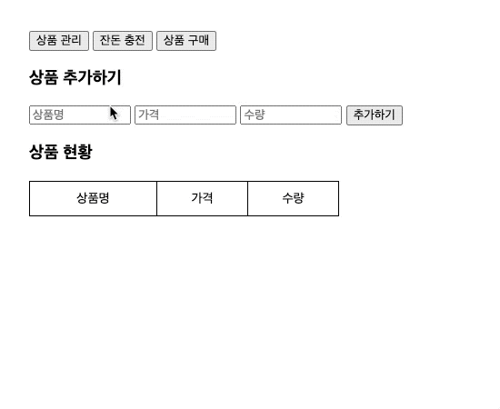
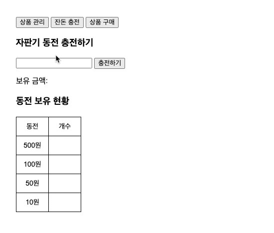
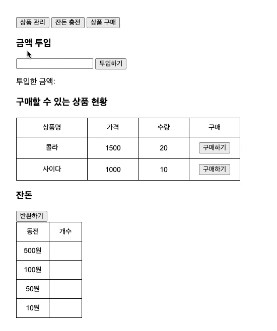

<p align="middle" >
  
</p>
<h1 align="middle">자판기</h1>

## 🔍 진행방식

- 미션은 **기능 요구사항, 프로그래밍 요구사항, 과제 진행 요구사항** 세 가지로 구성되어 있다.
- 세 개의 요구사항을 만족하기 위해 노력한다. 특히 기능을 구현하기 전에 기능 목록을 만들고, 기능 단위로 커밋 하는 방식으로 진행한다.
- 기능 요구사항에 기재되지 않은 내용은 스스로 판단하여 구현한다.


## 🎯 기능 요구 사항
반환되는 동전이 최소한이 되는 자판기를 구현한다.
### 1) 공통

상단에 `탭`메뉴가 존재하며 각 탭에 따라 적절한 기능을 수행한다.

- `상품 관리`탭은 자판기가 보유하고 있는 **상품을 추가**하는 기능을 수행한다.
- `잔돈 충전`탭은 **자판기가 보유할 금액을 충전**하는 기능을 수행한다.
- `상품 구매`탭은 사용자가 **금액을 투입**할 수 있으며, 투입한 금액에 맞춰 **상품을 구매**하고, 남은 금액에 대해서는 **잔돈을 반환**하는 기능을 수행한다.
- 다른 탭으로 이동했다 돌아와도 기존 탭의 상태가 유지되어야 한다.
- localStorage를 이용하여, 새로고침하더라도 가장 최근에 작업한 정보들을 불러올 수 있도록 한다.

### 2) 상품 관리 탭

`상품 관리`탭에서, 다음과 같은 규칙을 바탕으로 상품을 추가한다.

- 최초 상품 목록은 비워진 상태이다.
- 상품명, 가격, 수량을 입력해 상품을 추가할 수 있다.
  - 상품 가격은 100원부터 시작하며, 10원으로 나누어 떨어져야 한다.
- 사용자는 추가한 상품을 확인할 수 있다.

### 3) 잔돈 충전 탭 (자판기 보유 동전)

`잔돈 충전` 탭에서, 다음과 같은 규칙으로 자판기 보유 금액을 충전한다.

- `잔돈 충전` 탭에서 최초 자판기가 보유한 금액은 0원이며, 각 동전의 개수는 0개이다.
- 잔돈 충전 입력 요소에 충전할 금액을 입력한 후, `충전하기` 버튼을 눌러 자판기 보유 금액을 충전할 수 있다.
  - 자판기 보유 금액은 `{금액}원` 형식으로 나타낸다.
- 자판기 보유 금액만큼의 동전이 무작위로 생성된다.
  - 동전의 개수는 `{개수}개` 형식으로 나타낸다.
- 자판기 보유 금액을 누적하여 충전할 수 있다. 추가 충전 금액만큼의 동전이 무작위로 생성되어 기존 동전들에 더해진다.
- 상품 구매 탭에서 투입한 금액은 자판기 보유 금액에 더하지 않는다.

### 4) 상품 구매 탭

`상품 구매`탭에서, 다음과 같은 규칙을 바탕으로 금액을 충전하고, 상품을 구매하며, 잔돈을 반환한다.

- `상품 구매` 페이지에서 최초 충전 금액은 0원이며, 반환된 각 동전의 개수는 0개이다.
- 사용자는 투입할 금액 입력 요소에 투입 금액을 입력한 후, `투입하기`버튼을 이용하여 금액을 투입한다.
  - 금액은 10원으로 나누어 떨어지는 금액만 투입할 수 있다.
  - 자판기가 보유한 금액은 `{금액}원` 형식으로 나타낸다.
- 금액은 누적으로 투입할 수 있다.
- 품절된 상품의 `구매하기` 버튼은 disabled 되어야 한다.
- 사용자는 `반환하기` 버튼을 통해 잔돈을 반환 받을 수 있다.

**상품 구매 > 잔돈 계산 모듈**

`상품 구매` 탭에서 잔돈 반환 시 다음과 같은 규칙을 통해 잔돈을 반환한다.

- 잔돈을 돌려줄 때는 현재 보유한 최소 개수의 동전으로 잔돈을 돌려준다.
- 지폐를 잔돈으로 반환하는 경우는 없다고 가정한다.
- 잔돈을 반환할 수 없는 경우 잔돈으로 반환할 수 있는 금액만 반환한다.
- 동전의 개수를 나타내는 정보는 `{개수}개` 형식으로 나타낸다.

---

### 💻 실행 결과 예시

#### 상품 관리


#### 잔돈 충전 


#### 상품 구매 및 잔돈 반환


---

## ✅ 프로그래밍 요구 사항

### DOM 선택자 
각 요소에 아래와 같은 선택자를 반드시 지정한다.

**탭 메뉴 버튼**

- `상품 구매` 탭으로 이동하는 메뉴 버튼 id는 `product-purchase-menu`이다.
- `잔돈 충전`탭으로 이동하는 메뉴 버튼 id는 `vending-machine-manage-menu`이다.
- `상품 관리`탭으로 이동하는 메뉴 버튼 id는 `product-add-menu`이다.

**상품 관리(추가) 메뉴**

- 상품 추가 입력 폼의 상품명 입력 요소의 id는 `product-name-input`이다.
- 상품 추가 입력 폼의 상품 가격 입력 요소의 id는 `product-price-input`이다.
- 상품 추가 입력 폼의 수량 입력 요소의 id는 `product-quantity-input`이다.
- 상품 `추가하기` 버튼 요소의 id는 `product-add-button`이다.
- 추가한 각 상품 요소의 class명은 `product-manage-item`이며, 하위에 아래 요소들을 갖는다.
  - 상품명에 해당하는 요소의 class명은 `product-manage-name`이다.
  - 가격에 해당하는 요소의 class명은 `product-manage-price`이다.
  - 수량에 해당하는 요소의 class명은 `product-manage-quantity`이다.

**잔돈 충전 (자판기 보유 동전) 메뉴**

- 자판기가 보유할 금액을 충전할 요소의 id는 `vending-machine-charge-input`이다.
- `충전하기` 버튼에 해당하는 요소의 id는 `vending-machine-charge-button`이다.
- 충전된 금액을 확인하는 요소의 id는 `vending-machine-charge-amount` 이다.
- 보유한 각 동전의 개수에 해당하는 요소의 id는 다음과 같다.
    - 500원: `vending-machine-coin-500-quantity`
    - 100원: `vending-machine-coin-100-quantity`
    - 50원: `vending-machine-coin-50-quantity`
    - 10원: `vending-machine-coin-10-quantity`

**상품 구매 메뉴**

- 투입 금액 입력 요소의 id는 `charge-input`이다.
- 투입하기 버튼 요소의 id는 `charge-button`이다.
- 투입한 금액을 확인하는 요소의 id는 `charge-amount`이다.
- 반환하기 버튼 요소의 id는 `coin-return-button`이다.
- 반환된 각 동전의 개수에 해당하는 요소의 id는 다음과 같다.
  - 500원: `coin-500-quantity`
  - 100원: `coin-100-quantity`
  - 50원: `coin-50-quantity`
  - 10원: `coin-10-quantity`
- 각 상품 요소의 class명은 `product-purchase-item`이고, 하위에 아래 요소들을 갖는다.
  - 구매 버튼에 해당하는 요소의 class명은 `purchase-button`이다.
  - 상품명에 해당하는 요소의 class명은 `product-purchase-name`이다.
  - 가격에 해당하는 요소의 class명은 `product-purchase-price`이다.
  - 수량에 해당하는 요소의 class명은 `product-purchase-quantity`이다.
  - 상품명은 `dataset` 속성을 사용하고 `data-product-name` 형식으로 저장한다.
  - 가격은 `dataset` 속성을 사용하고 `data-product-price` 형식으로 저장한다.
  - 수량은 `dataset` 속성을 사용하고 `data-product-quantity` 형식으로 저장한다.


---

### 라이브러리
- 잔돈을 무작위로 생성하는 기능은 [`MissionUtils` 라이브러리](https://github.com/woowacourse-projects/javascript-mission-utils#mission-utils)의 `Random.pickNumberInList`를 사용해 구한다.
  - `MissionUtils` 라이브러리 스크립트는 `index.html`에 이미 포함되어 전역 객체에 추가되어 있으므로, 따로 `import` 하지 않아도 구현 코드 어디에서든 사용할 수 있다.

  ```javascript
  // ex)
  const randomNumber = Random.pickNumberInList([10, 50, 100, 500]);
  ```

---

### 공통 요구사항

- 스크립트 추가 외에 주어진 `index.html`파일은 수정할 수 없다.
  - 스타일(css)은 채점 요소가 아니다.
- 모든 예외 발생 상황은 `alert`메서드를 이용하여 처리한다.
- 외부 라이브러리(jQuery, Lodash 등)를 사용하지 않고, 순수 Vanilla JS로만 구현한다.
- **[자바스크립트 코드 컨벤션](https://github.com/woowacourse/woowacourse-docs/tree/feature/styleguide/styleguide/javascript)을 지키면서 프로그래밍** 한다.
- **indent(인덴트, 들여쓰기) depth를 3이 넘지 않도록 구현한다. 2까지만 허용**한다.
  - 예를 들어 while문 안에 if문이 있으면 들여쓰기는 2이다.
  - 힌트: indent(인덴트, 들여쓰기) depth를 줄이는 좋은 방법은 함수(또는 메소드)를 분리하면 된다.
- **함수(또는 메소드)가 한 가지 일만 하도록 최대한 작게** 만들어라.
- 변수 선언시 `var` 를 사용하지 않는다. `const` 와 `let` 을 사용한다.
  - [const](https://developer.mozilla.org/ko/docs/Web/JavaScript/Reference/Statements/const)
  - [let](https://developer.mozilla.org/ko/docs/Web/JavaScript/Reference/Statements/let)
- `import` 문을 이용해 스크립트를 모듈화하고 불러올 수 있게 만든다.
  - [https://developer.mozilla.org/ko/docs/Web/JavaScript/Reference/Statements/import](https://developer.mozilla.org/ko/docs/Web/JavaScript/Reference/Statements/import)
- **함수(또는 메소드)의 길이가 15라인을 넘어가지 않도록 구현한다.**
  - 함수(또는 메소드)가 한 가지 일만 잘 하도록 구현한다.

---

## 📝 과제 진행 요구사항
- 미션은 [javascript-vendingmachine-precourse](https://github.com/woowacourse/javascript-vendingmachine-precourse/) 저장소를 Fork/Clone해 시작한다.
- **기능을 구현하기 전에 javascript-vendingmachine-precourse/docs/README.md 파일에 구현할 기능 목록을 정리**해 추가한다.
- **Git의 커밋 단위는 앞 단계에서 README.md 파일에 정리한 기능 목록 단위**로 추가한다.
   - [AngularJS Commit Message Conventions](https://gist.github.com/stephenparish/9941e89d80e2bc58a153) 참고해 commit log를 남긴다.
- 과제 진행 및 제출 방법은 [프리코스 과제 제출 문서](https://github.com/woowacourse/woowacourse-docs/tree/master/precourse) 를 참고한다.

## ✉️ 미션 제출 방법

- 미션 구현을 완료한 후 GitHub을 통해 제출해야 한다.
   - GitHub을 활용한 제출 방법은 [프리코스 과제 제출 문서](https://github.com/woowacourse/woowacourse-docs/tree/master/precourse) 를 참고해 제출한다.
- GitHub에 미션을 제출한 후 [우아한테크코스 지원 플랫폼](https://apply.techcourse.co.kr) 에 접속하여 프리코스 과제를 제출한다.
   - 자세한 방법은 [링크](https://github.com/woowacourse/woowacourse-docs/tree/master/precourse#제출-가이드) 를 참고한다.
   - **Pull Request만 보내고, 지원 플랫폼에서 과제를 제출하지 않으면 최종 제출하지 않은 것으로 처리되니 주의한다.**


### 🚨 과제 제출 전 체크리스트 - 0점 방지를 위한 주의사항
- 요구사항에 명시된 출력값 형식을 지키지 않을 경우 기능 구현을 모두 정상적으로 했더라도 0점으로 처리된다.
- 기능 구현을 완료한 뒤 아래 가이드에 따라 테스트를 실행했을 때 모든 테스트가 성공하는 지 확인한다. **테스트가 실패할 경우 0점으로 처리되므로, 반드시 확인 후 제출한다.**

### ✔️ 테스트 실행 가이드
- 테스트 실행에 필요한 패키지 설치를 위해 `Node.js` 버전 `14` 이상이 필요하다. 
- 다음 명령어를 입력해 패키지를 설치한다.     
```bash
// {폴더 경로}/javascript-vendingmachine-precourse/ 에서
npm install
```     

- 설치가 완료되었다면, 다음 명령어를 입력해 테스트를 실행한다.
```bash
// {폴더 경로}/javascript-vendingmachine-precourse/ 에서
npm run test
```

- 아래와 같은 화면이 나오며 모든 테스트가 pass한다면 성공! 


