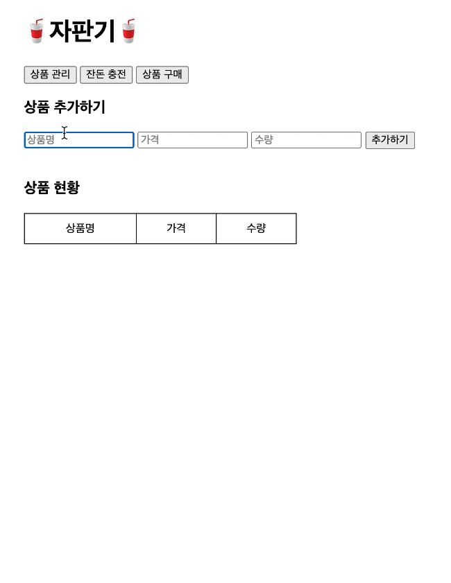
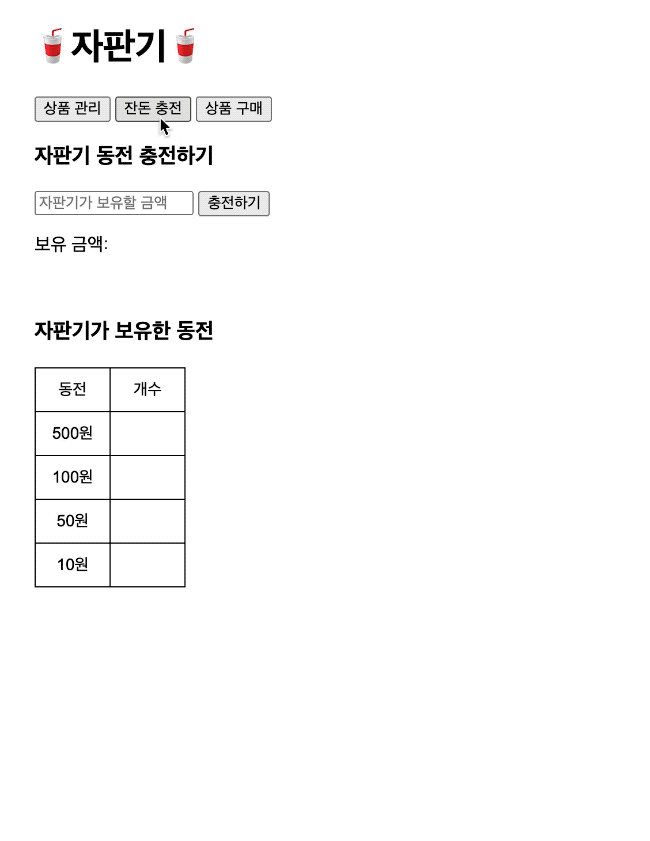
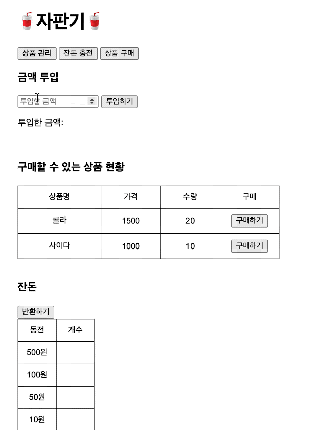

  

<h1 align="middle">자판기</h1>

- ## ✔️ 프로젝트를 들어가기 전에 

  이번 마지막 3주차 미션은 자동차 경주 게임을 아래의 요구사항에 맞춰 만드는 미션이다. 코딩컨벤션은 저번 미션과 마찬가지로 <NHN FE 개발랩>의 코딩컨벤션을 선택하여 따랐다. (ESLint 사용 예정) 또한 moudle 사용 건 때문에 별도로 https server를 설치하였다. 실행 시에는 `npm start` 를 하여 실행하면 된다.  

   

  필요한 기능은 아래와 같다. 저번 주차의 피드백을 수용하여, 부족한 점은 보완하려고 노력하였다.

   

  > Feedback 
  >
  > 1. 기능 목록 구현을 재검토한다.
  > 2. 값을 하드 코딩하지 마라.
  > 3. 축양하지 마라.
  > 4. 함수 라인 기준에 맞게 구현한다.
  > 5. commit 메세지에 "#번호"를 추가하지 않는다.
  > 6. 발생할 수 있는 예외 케이스에 대해 고민한다.
  > 7. 주석은 꼭 필요한 경우에만 남긴다.
  > 8. git을 통해 관리할 자원에 대해서 고려한다.
  > 9. JavaScript에서 제공하는 api를 적극 활용한다.
  > 10. Boolean을 return하는 경우 간결하게 한다.
  > 11. 불필요한 변수를 줄이기 위해 노력한다.
  > 12. 비즈니스 로직과 UI 로직을 분리하자.

   

  ## ✔️ 기능 이해 

  요구사항에 맞는 기능들을 생각해 보기 위해서 우선 필요한 기능들이 세부적으로 어떤 것이 있을지 고민해 보았다.

  각각 첫 실행 시, 상품 관리, 잔돈 충전, 상품 구매 및 잔돈 반환의 시나리오에 맞도록 필요 기능을 생각한 결과 아래와 같이 결론이 나왔다.  

  <h3>최종 목표</h3>
  반환되는 동전이 최소환이 되는 자판기를 구현한다.

   

  <h3>첫 실행 시</h3>

  - `상품관리 / 잔돈충전 / 상품구매` 버튼이 보여야 한다.
  - 각 탭을 클릭 시에 탭에 맞는 화면이 보여야 한다.

   

  <h3>상품 관리</h3>

  * `상품 추가하기, 상품 현황`에 대해서 보여주어야 한다.
  * 상품 추가하기 항목에서는 `상품이름 / 상품가격 / 상품수량` 그리고 `추가하기` 버튼이 있어야 한다.

  * 상품 현황 항목에서는 테이블 형태의 `상품명 / 가격 / 수량`에 관한 정보가 보여야 한다.
  * 추가하기 버튼을 눌렀을 때, 상품 현황에 input에 입력한 정보에 따라 테이블에 데이터를 생성해서 보여주어야 한다.
  * localStorage에 정보가 있을 경우 이를 불러와 보여준다.

  > 예외처리
  >
  > * 전체 입력 란 중, 하나라도 입력되지 않은 값이 있다면 alert로 모두 입력할 것으로 알려주기
  >
  > [1] 상품명
  >
  > - 상품명에 문자 이외에 특수문자가 들어가 있을 경우
  > - 상품명에 숫자만 기재되어 있을 경우
  >
  > [2] 가격 & 수량
  >
  > * 숫자 이외에 문자가 들어가 있을 경우
  > * 입력되는 숫자가 양의 정수가 아닐 경우
  > * 입력되는 숫자가 10으로 나누어 떨어지지 않을 경우
  > * 상품은 100원 이상이어야 함

   

  <h3>잔돈 충전</h3>

  * `자판기 동전 충전하기, 자판기가 보유한 동전`에 대하여 보여주어야 한다.
  * 자판기 동전 충전하기 항목에서는 `충전할 금액 입력` input 창과`충전하기` 버튼이 있어야 한다. 
  * 충전하기 버튼을 누르면 하단의 보유 금액에 충전한 금액을 보여준다.
  * 충전하기 버튼을 누르면 자판기가 보유한 동전 테이블에 금액에 맞는 동전이 무작위로 생성되도록 한다.
  * 보유한 동전 개수를 테이블에 표시해 주어야 한다.
  * 생성된 동전 개수롤 localStorage에 저장한다.
  * 누적하여 충전할 경우, 기존 동전 개수와 금액에 더하여 계산한다.

  > 예외처리
  >
  > * 충전 항목에서 input이 숫자 이외인 경우 
  > * 충전 항목에서 input이 공백인 경우
  > * 충전 항목이 10단위로 나누어 떨어지지 않을 경우
  > * 충전 항목이 양의 정수가 아닐 경우

   

  <h3>상품 구매</h3>

  * `금액 투입 / 구매할 수 있는 상품 현황 / 잔돈`에 대하여 보여주어야 한다.
  * 금액 투입 항목에서는`투입 금액` input 창과 `투입하기` 버튼이 있어야 한다.
  * 투입하기를 누르면 투입한 금액을 표시한다.
  * 구매할 수 있는 상품 현황 항목에서는 등록했던 상품의 `상품명 / 가격 / 수량 / 구매 버튼`이 테이블 내에 표시된다.
  * 구매하기 버튼을 누르면 `투입된 금액 - 상품의 금액`을 실행한다.
  * 구매하기 버튼을 누르면 `본래 수량 - 1` 을 해준다.
  * (추가) 투입한 금액보다 상품 금액이 클 경우 상품을 구매할 수 없다는 alert를 해준다.

   

  <h3>잔돈 반환</h3>

  * 최소 개수의 동전으로 잔돈으로 반환한다.
  * 잔돈을 모두 반환할 수 없는 경우, 잔돈으로 반환할 수 있는 금액만 반환한다.

   

  

  ## ✔️ 클래스 및 함수 분리 (설계)

  위의 기능 이해를 바탕으로 클래스를 어떻게 분해하여 설계해야 할지 많이 고민했다. 목표는 기능 별로 관련 있는 것들끼리 묶어 하나의 클래스를 만들고, 그 클래스 단위도 비대해지지 않도록 설계하는 것을 목표로 하였다.

   

  <h3>root (최상위 디렉토리)</h3>

  <b>index.js</b> 

  - [ ] EventListener Setting 후 초기화 - `initEventListener`
  - [ ] 각각의 3가지 버튼 생성 (상품관리, 잔돈 충전, 상품 구매)

   

  <h3>constants (상수관리)</h3>

  <b>constants.js</b>

  - [ ] 각 요구사항에 맞는 DOM ID Setting
  - [ ] 각 탭에 맞는 안내 사항 (상품명,가격,수량 등) 문구 Setting

   

  <h3>view (dom 조작)</h3>

  > localStorage를 고려하여 결정할 것

  <b>createDOM.js</b> 

  >  DOM에 요소 추가하고 만드는 함수 집합

  - [ ] 버튼 만드는 함수 
  - [ ] table 만드는 함수
  - [ ] table data  `<td>` 만드는 함수
  - [ ] input 만드는 함수
  - [ ] text 만드는 함수

  <b>DOM_chargeManage.js</b>

  - [ ] 자판기 동전 충전하기, 자판기가 보유한 동전 text 추가
  - [ ] 자판기 동전 충전 input, button 요소 추가
  - [ ] 보유 금액 text 추가
  - [ ] 자판기가 보유한 동전 table 추가 

  <b>DOM_productManage .js</b>

  - [ ] 상품 추가하기, 상품 현황 text 추가
  - [ ] 상품 추가하기 input, button 추가
  - [ ] 상품 현황 table 추가

  <b>DOM_buyProducts .js</b>

  - [ ] 금액 투입, 구매할 수 있는 상품 현황, 잔돈 text 추가
  - [ ] 금액 투입 input, button 추가
  - [ ] 투입한 금액 text 추가
  - [ ] 구매할 수 있는 상품 현황 table 추가
  - [ ] 잔돈 button, table 추가

   

  <h3>controller (제어 함수)</h3>

  <b>chargeManage.js (잔돈관리)</b>

  - [ ] localStroage에서 등록된 잔돈 불러오기
  - [ ] DOM 초기화 하기 
  - [ ] 충전하기 버튼 이벤트 함수

  <b>productManage.js (상품관리)</b>

  - [ ] localStroage에서 등록된 상품 현황 불러오기
  - [ ] DOM 초기화 하기
  - [ ] 추가하기 버튼 이벤트 함수

  <b>buyProducts.js (상품구매)</b>

  - [ ] localStorage에서 등록된 상품 현황 불러오기
  - [ ] 불러온 정보로 table 만들기
  - [ ] table 내에 구매하기 버튼 함수 (투입 금액 처리, 수량 처리)
  - [ ] 구매 가능 여부 alert 처리

  <b>returnCharge.js (잔돈반환)</b>

  - [ ] 잔돈 table 초기화
  - [ ] 반환하기 버튼 이벤트 함수 (최소 반환 조건으로 동전 반환)

   

  <h3>Validation (조건 예외처리)</h3>

  <b>validateCharge.js</b>

  - [ ] 입력 되지 않은 값 alert
  - [ ] 상품명: 특수문자 허용X, 숫자만X
  - [ ] 상품가격: 숫자 이외 문자X, 양의 정수만, 10으로 나누어 떨어지도록

  <b>validateProduct.js</b>

  - [ ] 충전 input: 숫자만 입력, 공백X, 10 단위로 나누어 떨어지도록, 양의 정수만

  <b>validateBuy.js</b>

  - [ ] 투입 금액 < 상품금액이면, 구매할 수 없다는 alert 

   

   

  위의 분리된 기능을 가지고 다음의 프로세스로 프로그래밍을 하는 것을 계획으로 세웠다.  

  >1. 분리한 클래스 및 함수 스켈레톤 코드 작성
  >2. 필요한 Constant 생성 및 관리
  >3. 각 탭에 필요한 DOM 요소 요구사항에 맞도록 생성
  >4. 각 요소에 필요한 EventListener 함수 작성
  >5. 기능 별로 필요한 함수 단위 파악 후 작성

   

  +) 스스로 어느정도의 역량을 갖추고 있을지 궁금하여 시간을 따로 측정해 보았다.

  * 설계하는 데 소요 시간 (1.5h)
  * 개발하는 데 소요 시간 

   

  ## ✔️ Test 결과

  

  

   

## 🎯 기능 요구 사항
반환되는 동전이 최소한이 되는 자판기를 구현한다.
### 1) 공통

상단에 `탭`메뉴가 존재하며 각 탭에 따라 적절한 기능을 수행한다.

- `상품 관리`탭은 자판기가 보유하고 있는 **상품을 추가**하는 기능을 수행한다.
- `잔돈 충전`탭은 **자판기가 보유할 금액을 충전**하는 기능을 수행한다.
- `상품 구매`탭은 사용자가 **금액을 투입**할 수 있으며, 투입한 금액에 맞춰 **상품을 구매**하고, 남은 금액에 대해서는 **잔돈을 반환**하는 기능을 수행한다.
- 다른 탭으로 이동했다 돌아와도 기존 탭의 상태가 유지되어야 한다.
- localStorage를 이용하여, 새로고침하더라도 가장 최근에 작업한 정보들을 불러올 수 있도록 한다.

### 2) 상품 관리 탭

`상품 관리`탭에서, 다음과 같은 규칙을 바탕으로 상품을 추가한다.

- 최초 상품 목록은 비워진 상태이다.
- 상품명, 가격, 수량을 입력해 상품을 추가할 수 있다.
  - 상품 가격은 100원부터 시작하며, 10원으로 나누어 떨어져야 한다.
- 사용자는 추가한 상품을 확인할 수 있다.

### 3) 잔돈 충전 탭 (자판기 보유 동전)

`잔돈 충전` 탭에서, 다음과 같은 규칙으로 자판기 보유 금액을 충전한다.

- `잔돈 충전` 탭에서 최초 자판기가 보유한 금액은 0원이며, 각 동전의 개수는 0개이다.
- 잔돈 충전 입력 요소에 충전할 금액을 입력한 후, `충전하기` 버튼을 눌러 자판기 보유 금액을 충전할 수 있다.
  - 자판기 보유 금액은 `{금액}원` 형식으로 나타낸다.
- 자판기 보유 금액만큼의 동전이 무작위로 생성된다.
  - 동전의 개수는 `{개수}개` 형식으로 나타낸다.
- 자판기 보유 금액을 누적하여 충전할 수 있다. 추가 충전 금액만큼의 동전이 무작위로 생성되어 기존 동전들에 더해진다.

### 4) 상품 구매 탭

`상품 구매`탭에서, 다음과 같은 규칙을 바탕으로 금액을 충전하고, 상품을 구매하며, 잔돈을 반환한다.

- `상품 구매` 페이지에서 최초 충전 금액은 0원이며, 반환된 각 동전의 개수는 0개이다.
- 사용자는 투입할 금액 입력 요소에 투입 금액을 입력한 후, `투입하기`버튼을 이용하여 금액을 투입한다.
  - 금액은 10원으로 나누어 떨어지는 금액만 투입할 수 있다.
  - 자판기가 보유한 금액은 `{금액}원` 형식으로 나타낸다.
- 금액은 누적으로 투입할 수 있다.
- 사용자는 `반환하기` 버튼을 통해 잔돈을 반환 받을 수 있다.

**상품 구매 > 잔돈 계산 모듈**

`상품 구매` 탭에서 잔돈 반환 시 다음과 같은 규칙을 통해 잔돈을 반환한다.

- 잔돈을 돌려줄 때는 현재 보유한 최소 개수의 동전으로 잔돈을 돌려준다.
- 지폐를 잔돈으로 반환하는 경우는 없다고 가정한다.
- 잔돈을 반환할 수 없는 경우 잔돈으로 반환할 수 있는 금액만 반환한다.
- 동전의 개수를 나타내는 정보는 `{개수}개` 형식으로 나타낸다.

---

### 💻 실행 결과 예시

#### 상품 관리

#### 잔돈 충전 

#### 상품 구매 및 잔돈 반환

