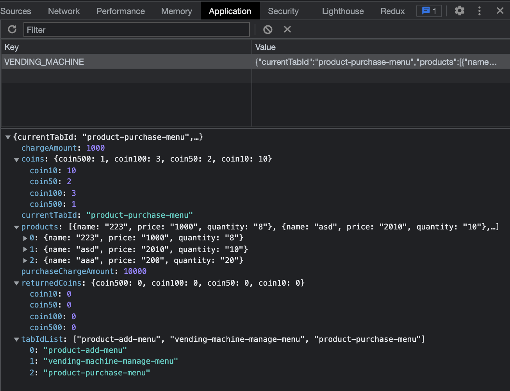

<p align="middle" >
  
</p>
<h1 align="middle">자판기</h1>

---

### 자판기 프리코스 3주 차 미션
> 반환되는 동전이 최소한이 되는 자판기

---

## 목차
- 📦 파일 구조
- 👊 컴포넌트 구조
- 📜 구현할 기능 목록

---

## 📦 파일 구조

```
src
├── App.js
├── components
│   ├── Menu.js
│   ├── charge_manage
│   │   ├── CoinStatus.js
│   │   ├── InputForm.js
│   │   └── Main.js
│   ├── product_add
│   │   ├── InputForm.js
│   │   ├── Main.js
│   │   └── ProductStatus.js
│   ├── product_purchase
│   │   ├── CoinReturnStatus.js
│   │   ├── InputForm.js
│   │   ├── ItemSatus.js
│   │   └── Main.js
│   └── root
│       └── Component.js
├── libs
│   ├── api.js
│   └── key.js
├── style
│   └── setTableStyled.js
└── utils
    ├── coin.js
    ├── getCoinUnitText.js
    └── validation.js

```

---

## 👊 컴포넌트 구조

### `/App.js`
- 비즈니스 로직 컨트롤러
- 하위 컴포넌트에 props 제어

### `/libs/api.js`
- **localStorage 데이터 저장**
- 페이지의 정보를 새로고침 하더라도 유지하기 위한 class
- 기본 data구조
```
const data = {
      currentTabId: "product-add-menu",
      products: [],
      tabIdList: [
        "product-add-menu",
        "vending-machine-manage-menu",
        "product-purchase-menu",
      ],
      chargeAmount: 0,
      coins: {
        coin500: 0,
        coin100: 0,
        coin50: 0,
        coin10: 0,
      },
      returnedCoins: {
        coin500: 0,
        coin100: 0,
        coin50: 0,
        coin10: 0,
      },
      purchaseChargeAmount: 0,
    };

```


- KEY값
```
const KEY = "VENDING_MACHINE";
```

### `/components/root/Component/js`
- 최상위 컴포넌트 부모 클래스
- 컴포넌트의 생명주기 클래스
- 컴포넌트의 상태관리를 제어한다.
- 컴포넌트의 생성, 렌더링을 제어한다
- 컴포넌트의 이벤트리스너를 제어한다.

### `/components/Menu.js`
- 메뉴 탭 컴포넌트
- 현재 메뉴 탭 id 값 제어

### `/components/charge_manage`
- `/Main.js`
  - 잔돈 충전 탭 컴포넌트
- `/InutForm.js`
  - 잔동 충전 input 제어
- `/CoinStatus.js`
  - 보유 금액 만큼의 동전을 생성한다
  - 동전을 보여준다

### `/components/product_add`
- `/Main.js`
  - 상품 관리 탭
- `/InputForm.js`
  - 상품을 입력한다
- `/ProductStatus.js`
  - 입력된 상품의 정보를 보여준다

### `/components/product_purchase`
- `/Main.js`
  - 상품 구매 탭
- `/Input.js`
  - 금액 투입 입력 제어
- `/ItemStatus.js`
  - 구매할 수 있는 상품 현황을 보여준다
  - 구매하기 버튼 클릭 시
    - 해당 상품을 구매하고 상품의 수량 정보를 수정한다.
    - 해당 상품의 가격 만큼 투입한 금액을 차감한다.
- `/CoinReturnStatus.js`
  - 반환하는 잔돈이 최소한 이 되는 동전의 개수를 반환한다.
  - 반환된 금액 만큼 보유한 동전의 개수 및 돈을 차감한다.

### `/utils`
- `/validation.js`
  - 입력 정보 유효성 판단
- `/coin.js`
  - getRandomChargeCoins(charge)
    - 잔돈 충전 시, 무작위 잔돈 생성 함수
  - getSumCoins(prevCoins, newCoins)
    - 이전 잔돈의 개수와 새롭게 충전한 잔돈의 개수를 더하는 함수
- `/getCoinUnitText.js`
  - 동전 단위 출력 함수

### `/style/setTableStyled.js`
- 테이블 요소의 스타일 속성을 제어한다.

---

## 📜 구현할 기능 목록
- [x] localStorage 이용하여 정보를 유지한다.
- 탭 메뉴
  - [x] 탭 클릭 시 탭으로 이동한다.
  - [x] 탭의 상태는 유지 되어야 한다.
- 상품관리 탭
  - [x] 최초 상품 목록은 비워진 상태이다.
  - [x] 상품을 추가 한다.
    - [x] 상품 가격은 100원 이상, 10원 단위로 나누어 떨어져야 한다.
    - [x] 수량은 1이상의 양의 정수여야 한다.
  - [x] 모든 상품을 실시간 보여준다.
- 잔돈 충전 탭
  - 충전할 금액을 입력 받아야 한다.
    - [x] 금액은 10원 이상, 10원으로 나누어 떨어져야 한다.
  - [x] 보유 금액을 보여준다.
    - [x] 보유 금액은 충전할 금액이 누적 되어야 한다.
  - 보유 중인 동전의 개수를 보여줘야 한다.
    - [x] 단위는 500, 100, 50, 10원 이다.
    - [x] 충전 금액의 동전은 무작위로 생성되어야 한다.
    - [x] 동전의 개수는 실시간으로 누적되어야 한다.
- 상품 구매 탭
  - [x] 최초 충전 금액은 0원, 반환된 각 동전의 개수는 0개여야 한다.
  - [x] 금액은 입력한다
    - [x] 투입할 금액은 10원 이상, 10원으로 나누어 떨어져야 한다.
  - [x] 투입한 금액은 누적되어 화면에 보여져야 한다.
  - [x] 반환하기 버튼 클릭 시 잔톤을 반환 받아야 한다
    - [x] 잔돈은 현재 보유한 최소 개수의 동전을 반환해야 한다.
    - [x] 지폐를 잔돈으로 반환 할 수 없다
    - [x] 잔돈을 반환하지 못할 경우 반환할 수 있는 금액만 반환한다
  - [x] 구매하기 클릭 시 해당 상품의 수량이 줄어든다
  - [x] 구매하기 클릭 시 해당 상품의 가격 만큼 투입한 금액이 줄어든다
  - [x] 구매할 수 없는 경우 alert 예외처리를 한다
  - [x] 동전의 단위는 '개', 투입한 금액의 단위는 '원'으로 화면에 보여줘야 한다.
- 미션 요구사항
  - DOM 선택자 지정하기
    - [x] 탭 메뉴
    - [x] 상품 관리 메뉴
    - [x] 잔동 충전 메뉴
    - [x] 상품 구매 메뉴
  - [x] 잔돈 무작위 생성 기능 MissionUtils 라이브러리 Random.pickNumberInList 사용하기
  - [x] index.html 파일 수정 하지 않기!!!
  - [x] 모든 예외 발생 상황은 alert 메서드를 이용하기
---