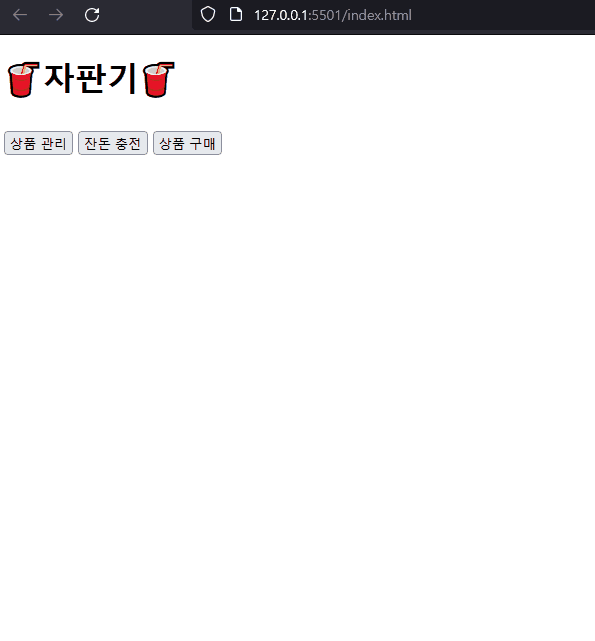
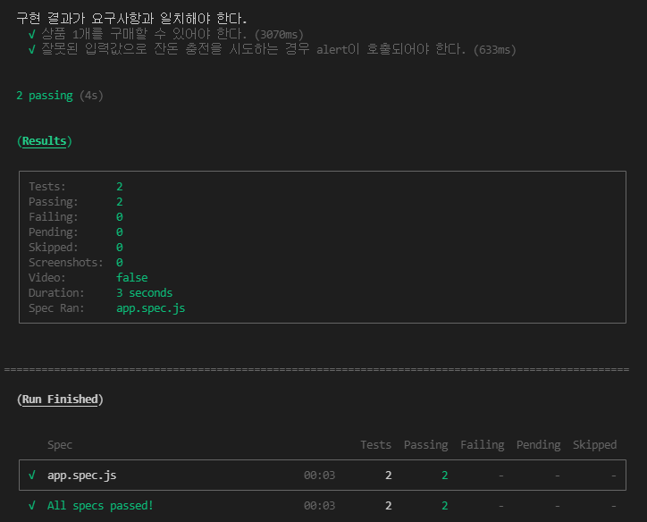

# 프리코스 3주차 - 자판기 구현하기 ⚾

## 🕹️ 작동 결과




## 💁‍♂️ 구현 기능 목록

#### 사용자 입력란 유효성 체크 기능 🧩

* 상품 추가 시
  * 🚨 예외 사항
    * [x] 상품명, 가격, 수량 중 빈칸이 있을 시.
    * [x] 가격, 수량 중 숫자 외 문자를 입력할 시.
    * [x] 가격이 100원 이하이거나, 10원 단위가 아닐 시.
    * [x] 수량이 0개 이하일 시.
* 자판기 동전 충전 및 상품 금액 충전 시
  * 🚨 예외 사항
    * [x] 금액이 숫자가 아닐 시.
    * [x] 금액이 10원 단위가 아닐 시.

#### 상품 관리 기능 🧩

* 이름, 가격, 수량을 입력 받아 상품을 추가할 수 있다.
  * 🚨 예외 사항
    * [x] 이미 해당 상품이 있을 시 기존 수량에서 추가 및 가격 정보를 최근 입력으로 갱신한다.
* 상품을 1개씩 구매할 수 있다.
  * 🚨 예외 사항
    * [x] 상품이 모두 소모되었을 때 해당 상품을 리스트에서 제거한다.
* 특정 상품의 정보(이름, 가격, 수량)를 가져올 수 있다.

#### 동전 관리 기능 🧩

* 동전 추가 기능

  금액을 설정하면 금액만큼의 동전이 무작위로 기존 동전 목록에 누적되어 추가된다.

* 동전 반환 기능

  잔돈을 반환 요청할 시 설정한 동전 목록을 기준으로 남아있는 동전들을 최소 개수로 반환한다.

* 동전 총액 합산 기능

  설정한 동전 목록의 총액 계산한다.


#### 메뉴 및 탭 전환 기능 🔎

* 메뉴의 버튼을 클릭하여 탭을 전환할 수 있다.
* 탭을 전환하더라도 기존 탭의 내용은 유지된다.

#### 상품 관리 페이지 🔎

* 상품을 추가할 수 있는 입력폼을 출력하며, 추가 버튼 클릭으로 상품 추가를 요청할 수 있다.
  * 🚨 예외 사항
    * [x] 상품 추가 요청 시 상품명에서 HTML 태그를 제거하여 처리한다.
  * 💡 편의 사항
    * [x] 사용자가 입력란에서 엔터를 누를 시 다음 입력란 포커스 및 버튼을 클릭하여 준다.
    * [x] 사용자가 상품을 추가한 후 다시 상품명 입력란을 포커스하여 준다.
* 현재 추가된 상품 현황을 상품명, 가격, 수량 순으로 출력한다.

#### 자판기 보유 동전 관리 페이지 🔎

* 자판기가 보유한 동전을 추가할 수 있는 입력폼을 출력하며, 추가 버튼 클릭으로 동전 추가를 요청할 수 있다.
  * 💡 편의 사항
    * [x] 사용자가 입력란에서 엔터를 누를 시 다음 버튼을 클릭하여 준다.
* 현재 자판기가 보유한 동전을 종류 / 수량 순으로 높은 금액의 동전 순으로 출력한다.

#### 상품 구매 및 동전 반환 페이지 🔎

* 사용자가 입력란에 금액을 입력하여, 자판기에 금액을 투입할 수 있다.
* 자판기에 금액을 투입한 후 사용자가 등록한 상품을 구매할 수 있다.
  * 🚨 예외 사항
    * [x] 사용자가 충전한 잔액이 부족할 시 경고창을 띄워준다.
    * [x] 상품을 모두 구매하였을 시 리스트에서 제거하여 준다.

* 반환하기 버튼을 통해 사용자가 투입한 금액을 자판기에 남은 동전을 기준으로 최소한의 동전 갯수로 반환을 요청할 수 있다.
  * 🚨 예외 사항
    * [x] 사용자의 잔돈 반환 요청 시 자판기가 보유한 동전 개수가 부족하다면 투입 금액에서 반환하지 못한 금액을 유지한다.

* 반환하기를 통해 반환된 동전 갯수를 높은 금액 순서로 출력한다.


#### 컴포넌트 기능 ⚙

* `index.html`을 활용하지 않고 `components` 폴더의 스크립트들을 기준으로 화면을 작성한다.
* 사용자 입력 이벤트를 위임할 수 있다.
* 하위 컴포넌트를 설정할 수 있다.

#### 컴포넌트 상태 관리/공유 기능 ⚙

* 여러 컴포넌트 간 상태를 공유할 수 있다.
* 상품, 동전, 충전 금액을 나누어 상태를 관리한다.
* 상태를 브라우저에 저장할 수 있어, 페이지를 새로고침하여도 상태를 유지할 수 있다.
  * 추가한 상품 목록
  * 자판기에 충전된 동전 목록
  * 사용자가 충전한 금액

#### 테이블 템플릿 작성 기능 ⚙

* 테이블의 템플릿을 설정할 시 테이블 엘리먼트를 생성하여 반환한다.


## 📁 디렉토리 구조

```bash
├── src
│   ├── models # 데이터 관리 기능 모음
│   │   ├── Coins.js # 동전 정보 데이터를 처리한다.
│   │   ├── Product.js # 상품 정보 데이터를 처리한다.
│   │   └── UserInputCheck.js # 유저 입력 데이터를 검증한다.
│   │
│   ├── components # 컴포넌트 페이지 모음
│   │   ├── product
│   │   │   ├── ProductInputForm.js # 상품 추가 입력란
│   │   │   └── ProductList.js # 상품 현황
│   │   │
│   │   ├── coins
│   │   │   ├── CoinInputForm.js # 자판기 보유 금액 충전 입력란
│   │   │   └── CoinList.js # 자판기 보유 금액 현황
│   │   │
│   │   ├── purchase
│   │   │   ├── ChargeInputForm.js # 구매 시 금액 충전 입력란
│   │   │   ├── PurchaseList.js # 구매 가능한 상품 현황 및 구매 목록
│   │   │   └── ReturnCoinResult.js # 반환된 잔돈 현황
│   │   │
│   │   ├── table
│   │   │   ├── ProductTable.js # 자판기 보유 상품 현황 테이블 템플릿
│   │   │   ├── CoinListTable.js # 자판기 보유 동전 현황 테이블 템플릿
│   │   │   ├── PurchaseTable.js # 구매 가능 상품 현황 및 구매 테이블 템플릿
│   │   │   └── ReturnTable.js # 반환 동전 현황 테이블 템플릿
│   │   │
│   │   ├── ProductManage.js # 상품 관리 페이지
│   │   ├── CoinsManage.js # 자판기 보유 동전 페이지
│   │   ├── PurchaseManage.js # 잔액 충전 & 상품 구매 페이지
│   │   │
│   │   └── StateList.js # 컴포넌트 공유 상태 목록
│   │
│   ├── controller
│   │   └── VendingMachine.js # 메인 컨트롤러
│   │
│   ├── core # 클래스 상속 요소 모음
│   │   ├── Component.js # 컴포넌트 기능
│   │   ├── Table.js # 테이블 생성 기능
│   │   └── State.js # 상태 관리 기능
│   │
│   ├── utils # 유틸리티 함수 모음
│   │   ├── data-tools.js # 데이터 처리 함수 모음
│   │   ├── element-tools.js # 엘리먼트 처리 함수 모음
│   │   ├── validation-tools.js # 유효성 검증 처리 함수 모음
│   │   └── error-alert.js # 오류 함수
│   │
│   ├── constants # 상수 모음
│   │   ├── config.js # 자판기 기본 설정
│   │   ├── constants.js # 각종 상수
│   │   └── display.js # 화면 출력 텍스트 및 선택자 상수
│   │
│   ├── App.js
│   └── index.js
│   │
├── docs
│   └── README.md
└── index.html
```


## 🎯 기능 요구 사항

### 1) 공통

- [x] `상품 관리`탭은 자판기가 보유하고 있는 **상품을 추가**하는 기능을 수행한다.
- [x] `잔돈 충전`탭은 **자판기가 보유할 금액을 충전**하는 기능을 수행한다.
- [x] `상품 구매`탭은 사용자가 **금액을 투입**할 수 있으며, 투입한 금액에 맞춰 **상품을 구매**하고, 남은 금액에 대해서는 **잔돈을 반환**하는 기능을 수행한다.
- [x] 다른 탭으로 이동했다 돌아와도 기존 탭의 상태가 유지되어야 한다.
- [x] localStorage를 이용하여, 새로고침하더라도 가장 최근에 작업한 정보들을 불러올 수 있도록 한다.

### 2) 상품 관리 탭

- [x] 최초 상품 목록은 비워진 상태이다.
- [x] 상품명, 가격, 수량을 입력해 상품을 추가할 수 있다.
  - [x] 상품 가격은 100원부터 시작하며, 10원으로 나누어 떨어져야 한다.
- [x] 사용자는 추가한 상품을 확인할 수 있다.

### 3) 잔돈 충전 탭 (자판기 보유 동전)

- [x] `잔돈 충전` 탭에서 최초 자판기가 보유한 금액은 0원이며, 각 동전의 개수는 0개이다.
- [x] 잔돈 충전 입력 요소에 충전할 금액을 입력한 후, `충전하기` 버튼을 눌러 자판기 보유 금액을 충전할 수 있다.
  - [x] 자판기 보유 금액은 `{금액}원` 형식으로 나타낸다.
- [x] 자판기 보유 금액만큼의 동전이 무작위로 생성된다.
  - [x] 동전의 개수는 `{개수}개` 형식으로 나타낸다.
- [x] 자판기 보유 금액을 누적하여 충전할 수 있다. 추가 충전 금액만큼의 동전이 무작위로 생성되어 기존 동전들에 더해진다.

### 4) 상품 구매 탭

- [x] `상품 구매` 페이지에서 최초 충전 금액은 0원이며, 반환된 각 동전의 개수는 0개이다.
- [x] 사용자는 투입할 금액 입력 요소에 투입 금액을 입력한 후, `투입하기`버튼을 이용하여 금액을 투입한다.
  - [x] 금액은 10원으로 나누어 떨어지는 금액만 투입할 수 있다.
  - [x] 자판기가 보유한 금액은 `{금액}원` 형식으로 나타낸다.
- [x] 금액은 누적으로 투입할 수 있다.
- [x] 사용자는 `반환하기` 버튼을 통해 잔돈을 반환 받을 수 있다.

**상품 구매 > 잔돈 계산 모듈**

- [x] 잔돈을 돌려줄 때는 현재 보유한 최소 개수의 동전으로 잔돈을 돌려준다.
- [x] 지폐를 잔돈으로 반환하는 경우는 없다고 가정한다.
- [x] 잔돈을 반환할 수 없는 경우 잔돈으로 반환할 수 있는 금액만 반환한다.
- [x] 동전의 개수를 나타내는 정보는 `{개수}개` 형식으로 나타낸다.


## ✅ 프로그래밍 요구 사항

### DOM 선택자 

**탭 메뉴 버튼**

- [x] `상품 구매` 탭으로 이동하는 메뉴 버튼 id는 `product-purchase-menu`이다.
- [x] `잔돈 충전`탭으로 이동하는 메뉴 버튼 id는 `vending-machine-manage-menu`이다.
- [x] `상품 관리`탭으로 이동하는 메뉴 버튼 id는 `product-add-menu`이다.

**상품 관리(추가) 메뉴**

- [x] 상품 추가 입력 폼의 상품명 입력 요소의 id는 `product-name-input`이다.
- [x] 상품 추가 입력 폼의 상품 가격 입력 요소의 id는 `product-price-input`이다.
- [x] 상품 추가 입력 폼의 수량 입력 요소의 id는 `product-quantity-input`이다.
- [x] 상품 `추가하기` 버튼 요소의 id는 `product-add-button`이다.
- [x] 추가한 각 상품 요소의 class명은 `product-manage-item`이며, 하위에 아래 요소들을 갖는다.
  - [x] 상품명에 해당하는 요소의 class명은 `product-manage-name`이다.
  - [x] 가격에 해당하는 요소의 class명은 `product-manage-price`이다.
  - [x] 수량에 해당하는 요소의 class명은 `product-manage-quantity`이다.

**잔돈 충전 (자판기 보유 동전) 메뉴**

- [x] 자판기가 보유할 금액을 충전할 요소의 id는 `vending-machine-charge-input`이다.
- [x] `충전하기` 버튼에 해당하는 요소의 id는 `vending-machine-charge-button`이다.
- [x] 충전된 금액을 확인하는 요소의 id는 `vending-machine-charge-amount` 이다.
- 보유한 각 동전의 개수에 해당하는 요소의 id는 다음과 같다.
  - [x] 500원: `vending-machine-coin-500-quantity`
  - [x] 100원: `vending-machine-coin-100-quantity`
  - [x] 50원: `vending-machine-coin-50-quantity`
  - [x] 10원: `vending-machine-coin-10-quantity`

**상품 구매 메뉴**

- [x] 투입 금액 입력 요소의 id는 `charge-input`이다.
- [x] 투입하기 버튼 요소의 id는 `charge-button`이다.
- [x] 투입한 금액을 확인하는 요소의 id는 `charge-amount`이다.
- [x] 반환하기 버튼 요소의 id는 `coin-return-button`이다.
- 반환된 각 동전의 개수에 해당하는 요소의 id는 다음과 같다.
  - [x] 500원: `coin-500-quantity`
  - [x] 100원: `coin-100-quantity`
  - [x] 50원: `coin-50-quantity`
  - [x] 10원: `coin-10-quantity`
- 각 상품 요소의 class명은 `product-purchase-item`이고, 하위에 아래 요소들을 갖는다.
  - [x] 구매 버튼에 해당하는 요소의 class명은 `purchase-button`이다.
  - [x] 상품명에 해당하는 요소의 class명은 `product-purchase-name`이다.
  - [x] 가격에 해당하는 요소의 class명은 `product-purchase-price`이다.
  - [x] 수량에 해당하는 요소의 class명은 `product-purchase-quantity`이다.
  - [x] 상품명은 `dataset` 속성을 사용하고 `data-product-name` 형식으로 저장한다.
  - [x] 가격은 `dataset` 속성을 사용하고 `data-product-price` 형식으로 저장한다.
  - [x] 수량은 `dataset` 속성을 사용하고 `data-product-quantity` 형식으로 저장한다.


### 추가 요구사항

- [x] 스크립트 추가 외에 주어진 `index.html`파일은 수정할 수 없다.
  - [x] 스타일(css)은 채점 요소가 아니다.


## 📚 테스트 결과




## ✍️ 작성자

* 우아한테크코스 프론트엔드 과정 지원자, **류현승**

